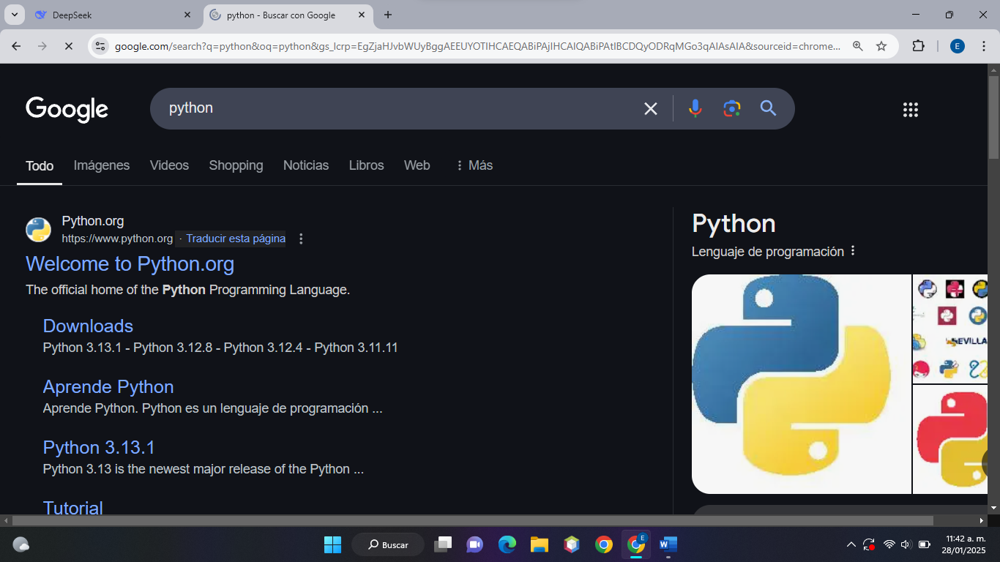
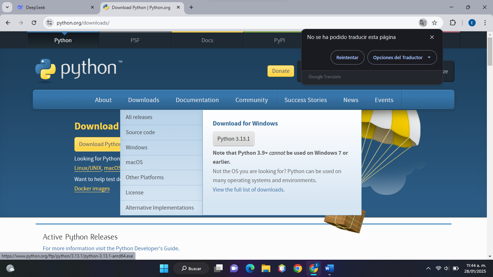
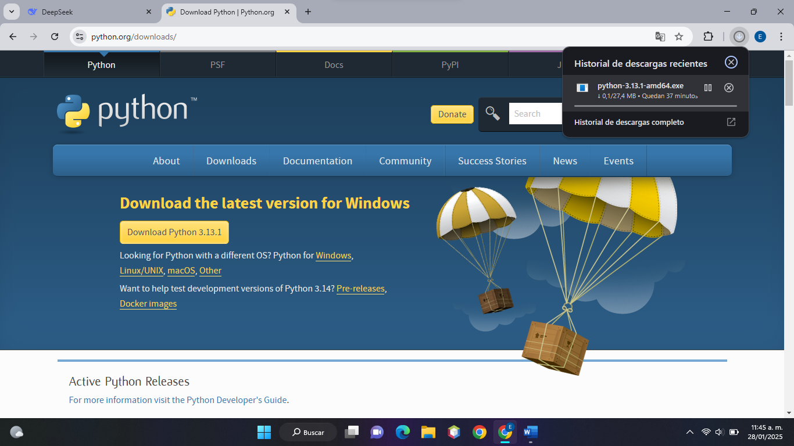
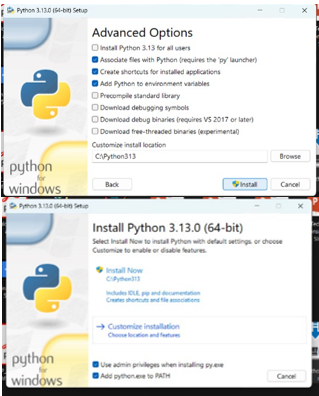
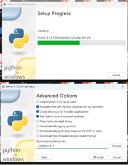
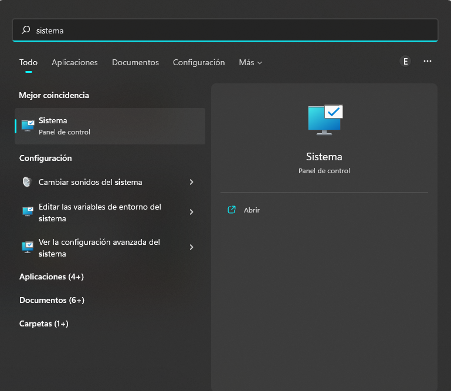
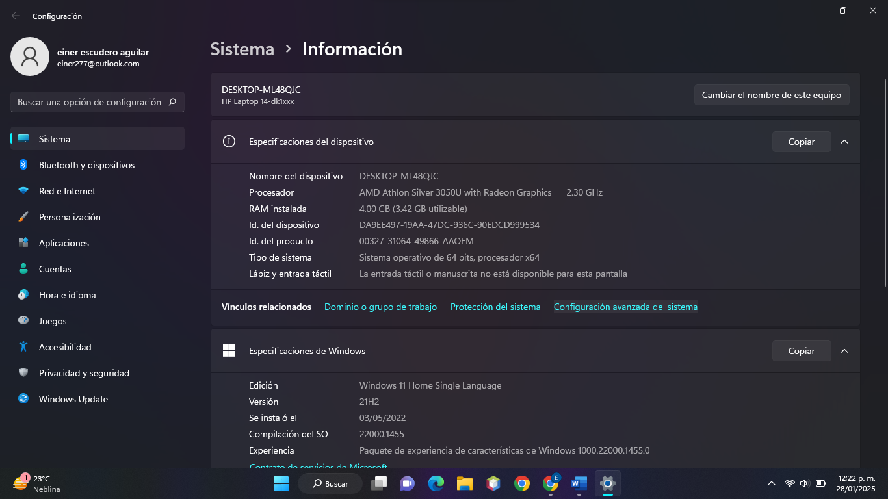
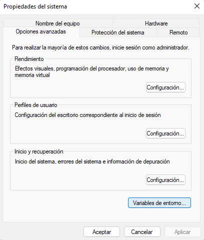
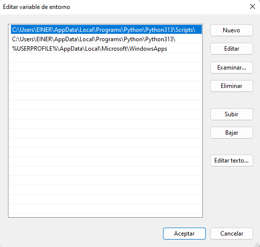

<!-- Comentarios -->

# INSTITUTO TECNOLOGICO SUPERIOR DE CHICONTEPEC 	 
## Ingeniería en Sistemas Computacionales 
### Materia: Ecuaciones diferenciales
#### Practica 1: 
##### Manual de instalación y configuración de Python 
###### Presenta: Einer Escudero Aguilar

**1.- Instalación de la herramienta en la unidad c:\Python**

*Primero escribimos en el buscador de Google “Python” y le damos clic en la primera opción que dice descargas:*

*Una ves que escojamos este apartado nos mandara a este menú en donde le daremos nuevamente en el apartado de descarga:*

*Luego se empezará a descargar la versión de Python seleccionada:*

*Una vez que se descargó se instalara en nuestro dispositivo, este paso es fácil ya que solo tendremos que darle en siguiente en las opciones y posteriormente en instalar:*

**2.- Configurar las variables de entorno**

*Una vez hecho esto configuraremos las variables del entorno: Esto lo aremos entrando en la opción de sistema de nuestro equipo*

*una vez dentro del daremos en la opción de configuración avanzada del sistema:*

*Cuando le demos en esta opción nos mostrara un menú, pero en este caso seleccionaremos la opción de variables de entorno:*

*Cuando le demos en esta opción le daremos doble clic en la parte que dice Path:*

*Y aquí ya nos aparecerá la versión de Python que tengamos instalada:*

<!-- GITHUB MARKDOWN -->
* [x]Task 1
* [ ]Task 2
* [ ]Task 3
* [x]Task 4

